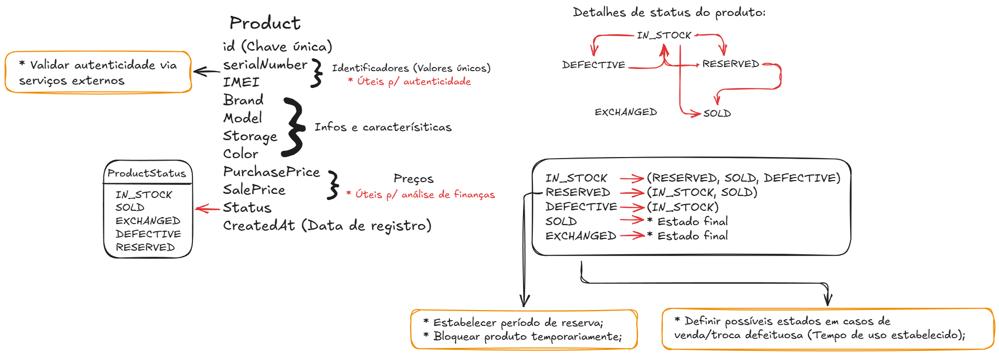
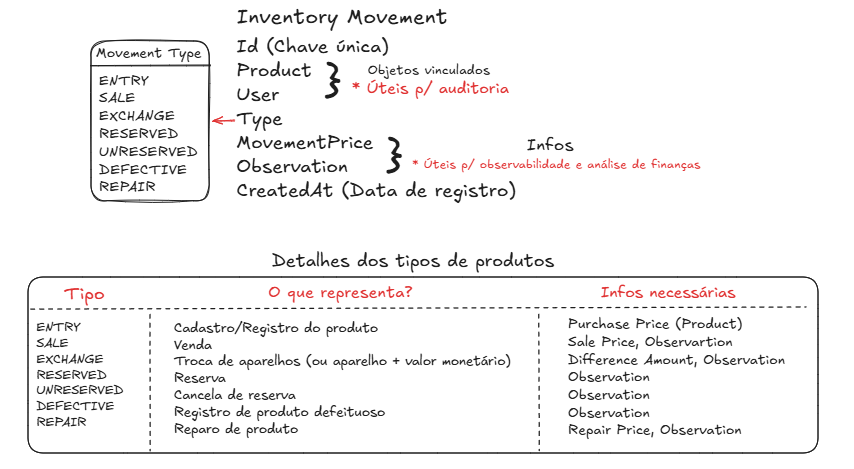
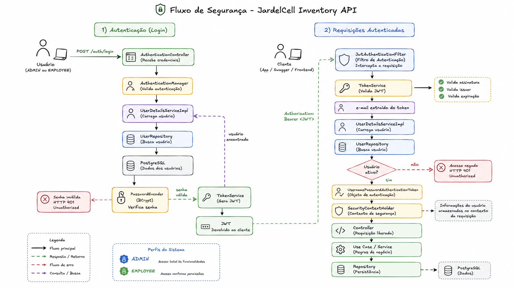

# 📦 JardelCell Inventory API


---

## 🌐 Experimente a aplicação

A API encontra-se publicada em produção. Clique nos botões abaixo para acessá-la ou explorar sua documentação:

[](https://inventory-api-i921.onrender.com)
[](https://inventory-api-i921.onrender.com/swagger-ui/index.html)

---

# 📌 Sobre o projeto

A **JardelCell Inventory API** é uma aplicação backend desenvolvida para gerenciar o estoque de dispositivos Apple da empresa JardelCell.

O sistema centraliza o gerenciamento completo do ciclo de vida dos dispositivos, permitindo acompanhar cada produto desde a sua entrada no estoque até a sua venda, troca, reserva, envio para reparo, retorno ao estoque ou descarte, mantendo o histórico completo das movimentações realizadas pelos colaboradores.

Além da resolução do problema de negócio, o projeto foi desenvolvido seguindo boas práticas de engenharia de software, adotando princípios como **Clean Code**, **SOLID**, arquitetura modular e autenticação baseada em **JWT**, buscando representar uma aplicação próxima ao ambiente corporativo.

---

# 🎯 Problema

Antes da aplicação, o controle do estoque era realizado manualmente, dificultando operações importantes como:

- localização rápida de aparelhos;
- controle de disponibilidade do estoque;
- rastreabilidade do histórico completo de cada aparelho;
- cálculo do investimento atual;
- acompanhamento do faturamento obtido com vendas e trocas;
- identificação do responsável por cada movimentação.

À medida que o volume de produtos aumentava, esse processo tornava-se cada vez mais suscetível a erros e inconsistências. 

Além disso, não existia uma forma simples de responder perguntas estratégicas como "quantos aparelhos estão em reparo?", "qual o investimento atual no estoque?" ou "quem realizou determinada movimentação?".

---

# 💡 Solução

A Inventory API foi desenvolvida para centralizar todo esse fluxo em uma única aplicação.

A solução proposta centraliza todas as operações relacionadas ao estoque em uma única API, oferecendo segurança, rastreabilidade e indicadores estratégicos para apoio às operações da empresa.

Entre as principais funcionalidades estão:

- cadastro de dispositivos Apple;
- autenticação utilizando JWT;
- controle de acesso por perfis (**ADMIN** e **EMPLOYEE**);
- gerenciamento completo das movimentações de estoque;
- dashboard com indicadores do negócio;
- rastreabilidade das operações realizadas pelos usuários;
- documentação automática via Swagger;
- migrações versionadas com Flyway;
- ambiente totalmente containerizado utilizando Docker.

---

# 🚀 Tecnologias utilizadas

| Categoria       | Tecnologias                 |
|-----------------|-----------------------------|
| Arquitetura     | Modular Monolith            |
| Linguagem       | Java 21                     |
| Framework       | Spring Boot                 |
| Segurança       | Spring Security + JWT       |
| Banco de Dados  | PostgreSQL                  |
| Persistência    | Spring Data JPA / Hibernate |
| Migrações       | Flyway                      |
| Testes          | JUnit 5 + Mockito           |
| Documentação    | Swagger / OpenAPI           |
| Containerização | Docker + Docker Compose     |
| Deploy          | Render                      |
| Build           | Maven                       |

---

# 🏗️ Arquitetura

A **JardelCell Inventory API** foi projetada seguindo uma arquitetura modular, organizando o sistema por contextos de negócio ao invés de camadas técnicas.

Essa abordagem aumenta a coesão entre componentes relacionados, reduz o acoplamento entre funcionalidades e facilita a manutenção e evolução do sistema conforme novas necessidades surgem.

As regras de negócio são centralizadas em Use Cases, responsáveis por orquestrar as operações da aplicação sem depender diretamente da infraestrutura.

Durante o desenvolvimento foram adotados princípios de **Clean Code**, **SOLID** e separação clara de responsabilidades, buscando adotar práticas comuns em aplicações corporativas.

---

## Estrutura geral

A aplicação está organizada em módulos independentes.

```text
src
├── auth
├── common
├── config
├── dashboard
├── inventory
├── product
├── security
└── user
```

Cada módulo concentra apenas os componentes necessários para sua responsabilidade de negócio, evitando dependências desnecessárias entre domínios.

Dentro de cada módulo encontram-se componentes como:

- Controller
- DTOs
- Entity
- Mapper
- Repository
- Service
- UseCase

Essa organização permite que cada domínio evolua de forma independente, mantendo o restante da aplicação estável.

---

## Fluxo da requisição

Toda requisição segue um fluxo bem definido desde sua autenticação até a persistência dos dados.

```
Cliente
    │
    ▼
Spring Security (JWT)
    │
    ▼
Controller
    │
    ▼
   DTO
    │
    ▼
Use Case
    │
    ▼
Repository
    │
    ▼
PostgreSQL
```

Cada camada possui uma responsabilidade específica:

| Camada     | Responsabilidade |
|------------|------------------|
| Security   | Autenticação e autorização da requisição |
| Controller | Receber e validar requisições HTTP |
| Use Case   | Executar regras de negócio |
| Repository | Persistência dos dados |
| Database   | Armazenamento permanente |

Essa separação reduz o acoplamento entre as camadas e facilita testes unitários, manutenção e evolução do software.

---

# 📦 Principais componentes

Os módulos abaixo concentram a maior parte das regras de negócio da aplicação e representam os principais fluxos existentes no sistema.

Cada componente possui responsabilidades bem definidas e foi desenvolvido buscando alta coesão e baixo acoplamento.

---

## 🤳 Product

O módulo **Product** representa o núcleo do estoque.

Cada produto cadastrado possui informações suficientes para permitir sua identificação individual, rastreabilidade e controle financeiro dentro da empresa.

Entre os dados armazenados destacam-se:

- modelo do dispositivo;
- número de série;
- IMEI;
- capacidade;
- cor;
- condição do aparelho;
- preço de compra;
- preço de venda;
- status atual do produto no estoque.

Além do cadastro dos dispositivos, este módulo também concentra as regras responsáveis por impedir inconsistências durante operações de movimentação, garantindo que apenas produtos em estados válidos possam participar de determinados fluxos da aplicação.



---

## 📦 Inventory Movement

Toda alteração realizada sobre um produto gera um registro permanente de movimentação.

Esse módulo foi desenvolvido para garantir rastreabilidade completa sobre o histórico de cada dispositivo.

Cada movimentação registra:

- produto movimentado;
- tipo da movimentação;
- usuário responsável;
- data e hora;
- observações quando necessárias.

Entre os tipos de movimentação implementados estão:

- Entrada em estoque;
- Venda;
- Troca;
- Reserva;
- Cancelamento da reserva;
- Envio para reparo;
- Retorno do reparo;
- Descarte.

Essa abordagem permite reconstruir todo o histórico operacional de qualquer aparelho presente no sistema.



---

## 🔐 Segurança

O controle de acesso da aplicação é realizado utilizando **Spring Security** e autenticação baseada em **JWT (JSON Web Token)**.

Após a autenticação, cada requisição protegida passa por um filtro responsável por validar o token recebido e reconstruir o contexto de autenticação da aplicação.

Os usuários são classificados em dois perfis:

- **ADMIN**
- **EMPLOYEE**

As permissões são controladas diretamente pelo Spring Security, restringindo o acesso às funcionalidades conforme o perfil autenticado.

Além disso, a aplicação adota boas práticas de segurança como:

- senhas armazenadas utilizando BCrypt;
- autenticação stateless;
- proteção contra acesso não autorizado;
- validação da assinatura e expiração dos tokens JWT;
- autorização baseada em Roles (ROLE_ADMIN e ROLE_EMPLOYEE);
- reconstrução do SecurityContext a cada requisição autenticada.



---

# 📊 Dashboard

A aplicação disponibiliza indicadores estratégicos para apoio à tomada de decisão, permitindo visualizar informações como:

- estoque disponível;
- aparelhos reservados;
- aparelhos defeituosos;
- aparelhos vendidos;
- aparelhos trocados;
- investimento atual em estoque;
- faturamento obtido com vendas;
- custos relacionados a reparos de dispositivos.

Os indicadores são calculados em tempo real diretamente a partir das movimentações persistidas no banco de dados.

---

# ⚙️ Como executar o projeto

## Pré-requisitos

Antes de executar a aplicação, certifique-se de possuir instalado:

- Java 21
- Maven 3.9+
- Docker
- Docker Compose

---

## Clonando o repositório

```bash
git clone https://github.com/fcolucasvieira/inventory-api.git

cd inventory-api
```

---

## Configurando as variáveis de ambiente

Crie um arquivo `.env` na raiz do projeto utilizando o arquivo `.env.example` como referência.

As principais variáveis utilizadas são:

```env
DATABASE_URL=
DATABASE_USERNAME=
DATABASE_PASSWORD=

JWT_SECRET=

ADMIN_FULL_NAME=
ADMIN_EMAIL=
ADMIN_PASSWORD=
```

Para ambiente de produção também podem ser definidos usuários iniciais do sistema através das variáveis:

```env
EMPLOYEE_1_FULL_NAME=
EMPLOYEE_1_EMAIL=
EMPLOYEE_1_PASSWORD=

EMPLOYEE_2_FULL_NAME=
EMPLOYEE_2_EMAIL=
EMPLOYEE_2_PASSWORD=
```

---

## Subindo o banco de dados

Para desenvolvimento basta iniciar o PostgreSQL utilizando Docker Compose.

```bash
docker compose up -d postgres
```

---

## Executando a aplicação

Após iniciar o banco de dados:

```bash
mvn spring-boot:run
```

A aplicação ficará disponível em:

```
http://localhost:8080
```

---

# 📚 Documentação da API

A documentação interativa está disponível através do Swagger.

Em ambiente local:

```
http://localhost:8080/swagger-ui/index.html
```

A documentação permite:

- autenticar usuários;
- testar endpoints;
- visualizar modelos de requisição e resposta;
- consultar contratos da API.

---

# ☁️ Deploy

O serviço encontra-se publicado na **Render** utilizando PostgreSQL gerenciado e variáveis de ambiente configuradas diretamente pela plataforma.

O deploy é realizado automaticamente a partir da branch principal do repositório.

A infraestrutura utiliza:

- Docker
- PostgreSQL
- Spring Profiles
- Variáveis de ambiente
- Health Check (`/actuator/health`)

Essa configuração aproxima o ambiente de produção do ambiente utilizado durante o desenvolvimento.

---

# 🧪 Testes

O projeto possui testes unitários focados nas principais regras de negócio.

Os testes concentram-se nas regras de negócio da aplicação, validando cenários críticos relacionados ao gerenciamento de produtos e movimentações de estoque.

Foram utilizados:

- JUnit 5
- Mockito

Os testes podem ser executados através do comando:

```bash
mvn test
```

---

# 🚀 Próximos passos

Entre as evoluções planejadas para o projeto estão:

- auditoria completa das operações;
- paginação e filtros avançados;
- exportação de relatórios;
- notificações por e-mail;
- integração com armazenamento de imagens dos dispositivos.

---

# 👨‍💻 Autor

Lucas Vieira

Estudante de Engenharia de Computação — UFC Sobral

GitHub:

https://github.com/fcolucasvieira

LinkedIn:

https://www.linkedin.com/in/fco-lucas-vieira/

